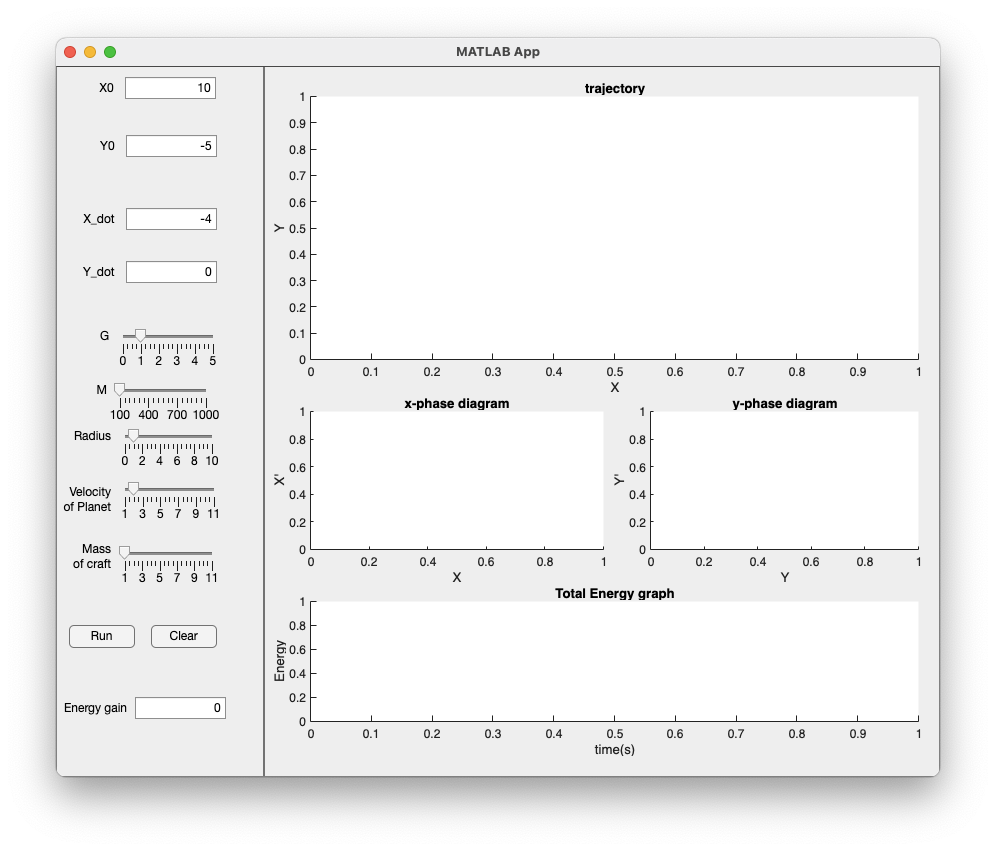
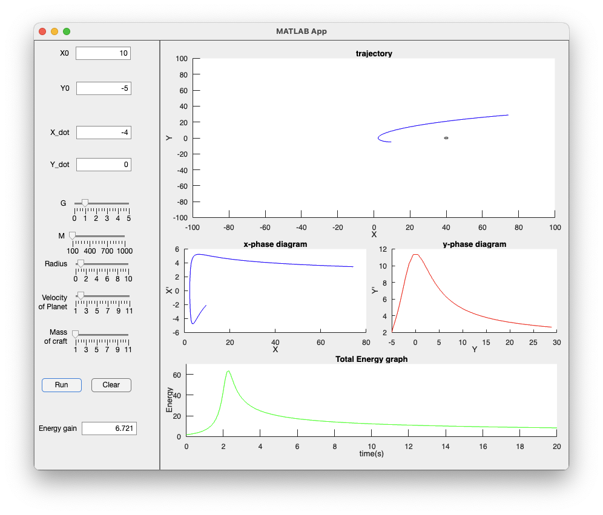

# gravity_assist_simulator_matlab
This is the simple matlab simulator of gravity assist. I made this for term project of course AE280, KAIST.

# Gravity Assist
**Gravity Assist** is one of method to get accelerating or decelerating from gravity.

The gravity field which produced by stationary mass is conservation field, so there is no gain on velocity.

The key point of gravity assist is that the mass source(ex: planets, sun) is **moving**.

# Principle
In this simulation, I got three assumptions.
- Describe all motions in 2D
- There are only **gravity interaction** between planet and spacecraft
- The planet is moving with constant velocity (ignore the gravity from spacecraft)

From these assumptions, I could get a differential equation of motion of spacecraft and motion of the planet.

$$\vec{r} = \vec{r}_{\text{spacecrafts}} - \vec{r}_{\text{planet}} \tag{1}$$

<a name="eq-2">

$$\frac{d^{2} \vec{r}}{d t^{2}} = - \frac{G M }{r} \hat{r} \tag{2}$$

</a>

$$\vec{r}_{\text{planet}} = (-u \cdot t, 0) \tag{3}$$

I caculated the trajectory of spacecraft from eq [(2)](#eq-2) using [4th order Runge-Kutta method][1].

# Way to use simulator
## Struceture

### Left side
Left one is the parameter controler part. There are several parameters and two buttons, Energy gain result.
- `X0` : The initial x-position of spacecraft
- `Y0` : The initial y-position of spacecraft
- `X_dot` : The initial x-velocity of spacecraft
- `Y_dot` : The initial y-velocity of spacecraft
- `G` : The gravitational constant
- `M` : The mass of planet
- `Radius` : The radius of planet
- `Velocity of Planet` : The velocity of the planet($u$)
- `Mass of craft` : The mass of spacecraft
- `Run` : Click to run the simulator
- `Clear` : Clear all plots and reset the parameters (**Don't click `Run` or `Clear` Button before simulatation are stopped!**)
- `Energy gain` : Show the how energy-gain after simulation are stopped

### Right side
Right side is the plots of trajectory and some graphs.
- Trajectory : Show the trajectory of spacecraft and motion of planet
- X-phase diagram, Y-phase diagram : Show the phase diagram of each components
- Total Energy graph : Show the total energy(kinetic energy + potential energy) plots versus time.

## Way to Use
1. Set parameters which you like
2. After finish to set parameters, click the `Run` button. Then simulator are running for 20 seconds. (You can change the parameters, but don't click `Run` and `Clear` button during running simulation)
3. After finish to run simulation, there are seen how many energy is gained in `Energy gain` field.
4. If you want to run more simulations, click `Clear` button and repeat the steps.

# Example of Result

THis is the example of results with default parameters.

[1]: https://en.wikipedia.org/wiki/Runge–Kutta_methods

# Reference
*Animation Plot in Matlab*. Lectures of AE280 Software Application in Aerospace Engineering, KAIST.

*Basics of Spacefilght: A Gravity Assist Primer*.(2024, Feb). NASA. https://science.nasa.gov/learn/basics-of-space-flight/primer/

*Gravity assist*. (2024, June 3). Wikipedia. https://en.wikipedia.org/wiki/Gravity_assist

*GUI/App Designer in matlab*. Lectures of AE280 Software Application in Aerospace Engineering, KAIST.

*Runge-Kutta methods*. (2024, June 6). Wikipedia. https://en.wikipedia.org/wiki/Runge%E2%80%93Kutta_methods

*Runge-Kutta Method*. Lectures of AE280 Software Application in Aerospace Engineering, KAIST.

Sample codes of Lab04 in this courses. Lab04 of AE280 Software Applications in Aerospace Engineering, KAIST.

TA Guik Baek's advice. (2024, May 8).

# More info
Check my github site: https://github.com/sungchol3/gravity_assist_simulator_matlab

